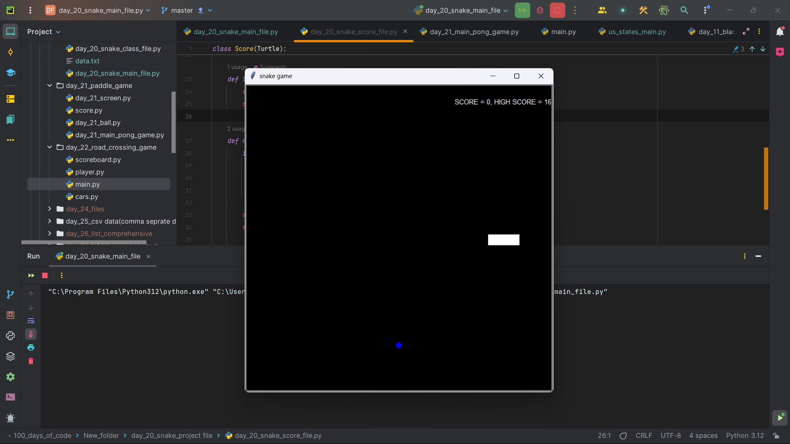
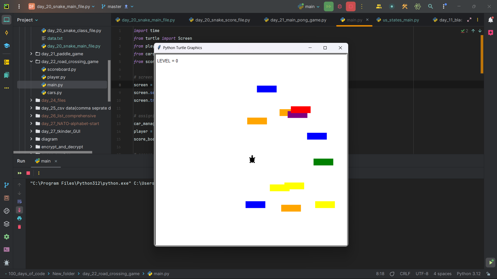
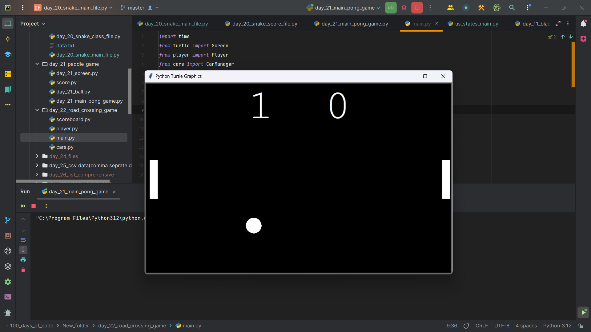
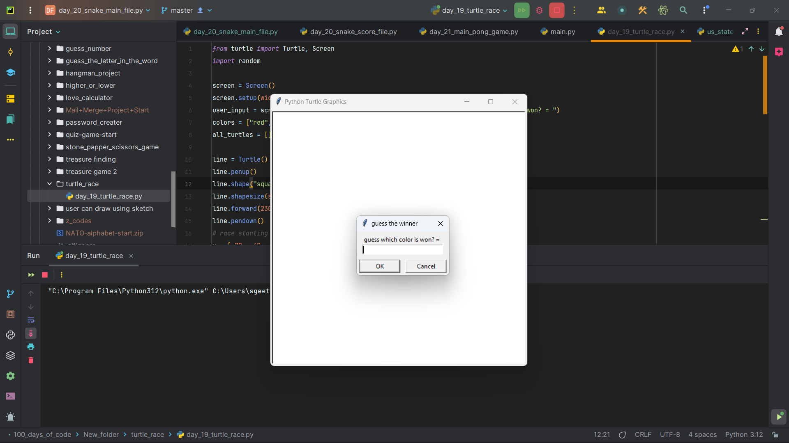
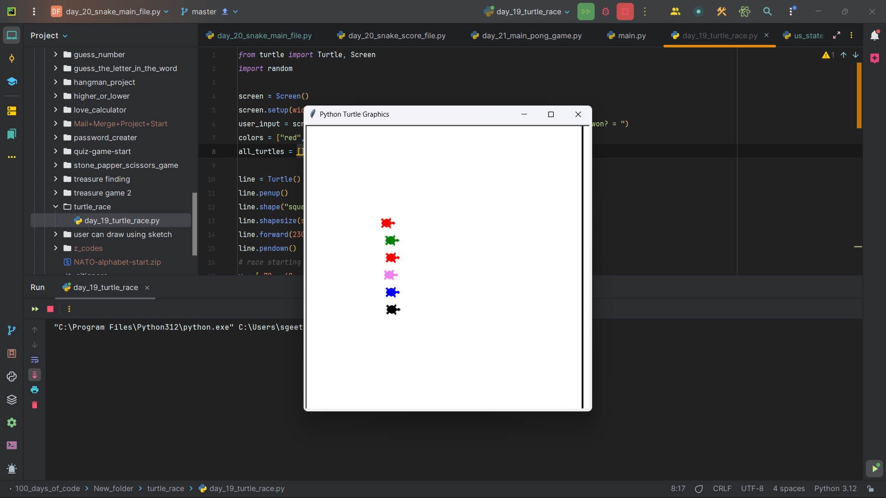

**Serpent's Adventure**  
The Classic Snake Game  
<h1>Snake Game 🐍</h1>
A fun, classic Snake game built using Python and pygame.  
Test your reflexes and strategic thinking as you guide the snake to eat food and grow longer without colliding with the walls or itself.

<h1>🎯 Objectives </h1>
<h3>Classic Gameplay:</h3>
Navigate the snake to collect food and grow.
<h3>Simple Controls:</h3>
Arrow keys to direct the snake’s movement.
the keys are up arrow, down arrow, left & and right arrows.
<h3>Challenge Yourself:</h3>
Avoid collisions to keep playing and score high.

<h1>💡 Key Features</h1>
<h3>Intuitive Controls:</h3>
  Easy to pick up with arrow key navigation.
<h3>Dynamic Scoring:</h3>
Score increases as the snake eats more food.
<h3>Game Over Logic:</h3>
Ends on collision with walls or the snake’s own body.
<h1>📋 InstallationC</h1>
<h3>lone the Repository:</h3>
  <pre>    git clone      https://github.com/suganesh007/Python_small_projects.git</pre>
  

  

<h3>Navigate to the Project Directory:</h3>
<pre>cd snake-game</pre>
<h3>Install Dependencies: </h3>
Ensure Python is installed. Install pygame:
<pre>pip install pygame</pre>
<h3>Run the Game: </h3>
Execute the game script:
<pre>python snake_game.py</pre>
<h1>Project Details</h1>
<h6>snake_game.py: </h6>  The main script where the game logic is implemented. 
<h6>assets/:</h6> Contains image files for the snake and food (if any).

<h1>🤔 How It Works</h1>
          <h6>Game Loop:</h6> Runs continuously to update game state and handle user inputs. 
          <h6>Collision Detection:</h6> Checks for collisions with walls and the snake’s own body. 
          <h6>Score Tracking:</h6> Keeps track of the player’s score and adjusts the game difficulty.

<h1>🐢 Turtle Road Crossing</h1>
  <h3>🕹 Overview</h3>
            Guide the turtle across the busy road! Dodge cars and reach the other side safely.
            
<h2>🚀 Features</h2>
          .Simple controls 🕹 
          Increasing difficulty 🚗🚙 
          Fun and challenging gameplay 🎯 

<h2>📸 Screenshots</h2>

  

          
<h1>🛠 Installation</h1>
        <h3>Clone the Repo:</h3>
        <pre>git clone
          https://github.com/yourusername/turtle-road-crossing.git
        </pre>
<h1>🎮 How to Play</h1>
<h3>Arrow Keys:</h3>
 1.) Move the turtle up, down, left, and right. 
 2.) Avoid getting hit by the cars!
 
<h3>🏁 Objective</h3>
      Help the turtle reach the other side of the road safely!
         
      
      
<h1>🏓 Paddle Game</h1>
<h3>🕹 Overview</h3>
    Classic paddle game where you control the paddle to keep the ball bouncing and prevent it from falling.
    
<h3>🚀 Features</h3>
        Single-player mode 🕹 
        Smooth paddle controls 
        🎮Increasing speed challenge 

<h2>📸 Screenshots</h2>

  
        
        
<h3>⚡🛠 Installation</h3>
  <h5>Clone the Repo:</h5>
        <pre>git clone
          https://github.com/yourusername/paddle-game.git</pre>
  <h5>Install Dependencies:</h5>
  <pre>pip install -r requirements.txt</pre>
  <h3>Run the Game:</h3>
          <pre>python paddle_game.py</pre>
  <h3>🎮 How to Play</h3>
  <h5>Arrow Keys: </h5>
          . Move the paddle left and right.
          . Keep the ball in play and rack up points!
  <h2>🏆 Goal</h2>
  Score as high as possible by keeping the ball in play as long as you can!

<h1>🐢 Turtle Racing Game</h1>
<h3>Overview</h3>
A simple and fun Python game where turtles race to the finish line! Place your bets and watch the race unfold.
<h3>Features</h3> 
🐢Multiple racing turtles 
🎲 Random race outcomes 
🎮 Easy and quick to play

<h3>How to Play</h3>
  Place your bet on your favorite turtle. 
  Start the race and see which turtle wins! 🏁

<h2>📸 Screenshots</h2>

    

  

<h1>🛠 Development</h1>
            Contributions and improvements are welcome! To contribute:
 

1.) Fork the repository. 
2.) Make your changes in a separate branch. 
3.) Submit a pull request for review.
<h1>📫 Contact</h1>
  For inquiries or feedback, you can reach me:
   
  <h6>Email:</h6>  <a href = "mailto:suganeshwaran.sg@gmail.com">suganeshwaran.sg@gmail.com</a> 
  <h6>GitHub:</h6> https://github.com/suganesh007/
